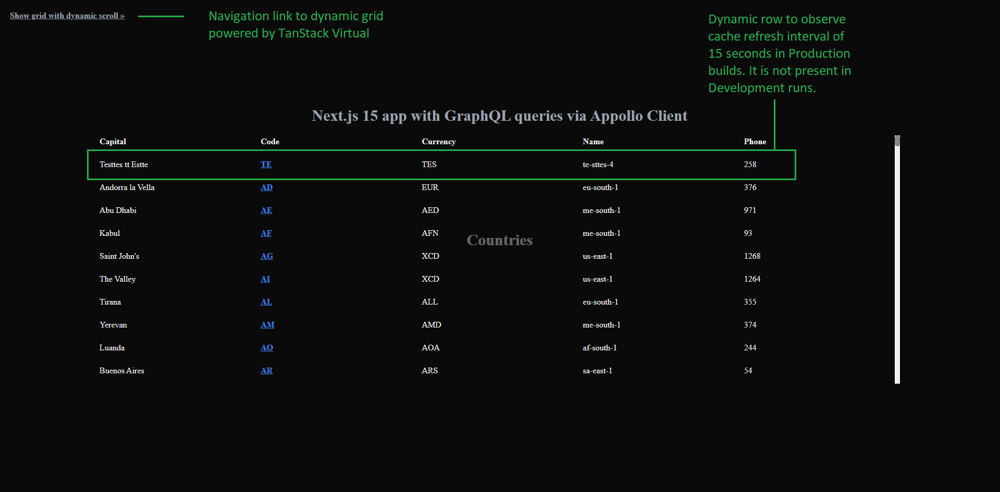

# Overview

This is an educational **Next.js 15 RC + React 19** project, which highlights concepts of using GraphQL with Appollo client.

- Homepage queries a public GraphQL service, which returns a list of countries with desired attributes.


- Data is presented in a tabular view with multiple attributes including country codes shaped as links.



- Click on a country code opens a country page using the standard feature of Next.js dynamic routes like [app/\[countrycode\]/page.tsx](app/[countrycode]/page.tsx)

- The country page queries the same GraphQL service but this time using the filter by "code" like
  <pre>
    query {
      countries(filter: {code: {eq: "countrycode"}}) {
        ...
      }
    }
  </pre>

- If data does not have country name in returned attributes, the logic additionally queries a public REST service supplying the country code to get the name.


# Simple steps to add support of GraphQL to Next.js environments

Use Appollo CLient. More details: https://www.apollographql.com/docs/react/get-started

1. Add two packages
   npm install @apollo/client graphql

2. Add the following code to your component
   <pre>
   import { ApolloClient, InMemoryCache, ApolloProvider, gql } from '@apollo/client';
   
   const client = new ApolloClient({
     uri: "https://countries.trevorblades.com/", // Put here URL of your GraphQL endpoint (server)
     cache: new InMemoryCache(),
   });
   
   const queryFilter = '(filter: {currency: {eq: "EUR"}})';
   client.query({
     query: gql`
       query {
         countries${queryFilter} {
           name: awsRegion
           capital
           code
           continent {
             code
             name
           }
           currencies
           currency
           languages {
             code
             name
             native
           }
           phone
           phones
           states {
             code
             country {
               name
             }
             name
           }
         }
       }
    `,
   }).then((result) => console.log(result));
   </pre>

# User interface

- The UI adjusts automatically to using a current system theme of user's environment, dark or light.

- A combination of loading.tsx + Suspense + fallback Shimmer control highlights usage of lazy server-side data loading.

  - Also, the server component [components/server/ContentHomeCountry.tsx](components/server/ContentHomeCountry.tsx) loads dynamically a client side component with disabled SSR.

  - This technique demonstrates how to solve classic SSR problems with using window and other client side only objects ported from old codebases.

- <a href="docs/images/3_country-page-loaded-in-light-system-theme.png">Country page</a> demonstrates usage of Radix UI Themes controls from the package @radix-ui/themes.

  - **Details** button visible on the page opens a right-hand side panel, which is made of slightly tweaked Radix UI Dialog.

  - All page elements support dynamic detection of a system theme change and correctly reflect this change with no page reloading.

    - For instance, open the right-hand side panel and change system theme from light to dark. <a href="docs/images/5_country-page-with-right-hand-panel-automatically-adjusted-to-dark-system-theme.png">The panel</a> should correctly reflect this change.

    - The logic uses window.matchMedia("(prefers-color-scheme: dark)") with "change" event listener. Please refer to shared/hooks/useSystemDarkMode

  - There are useful tailor-made features managed by settings defined in .env file.

    - pagecachetimeout=15: demostrates how to persist cache data on all pages for 15 seconds in production builds.

      - To show this, the first row in the home page table gets a test value with dynamic Phone property. This data persists for 15 seconds and then gets updated.

    - showVerticalScrollbar=true: demostrates correct settings of Radix Dialog to suppress undesired UI-layout shifts on opening the right-hand side panel in the browser window with a visible vertical scrollbar.

    - disableSidePanelLightClosing=true: demostrates how to prevent accidental closing of the right-hand side panel on "mouse click outside" and "ESC key press" events.

- CSS styling uses a combination of global.css, Tailwind, and modules to highlight different ways of using styles.

# Getting Started

Clone this project.

Review / adjust default settings found in .env

```bash
endpointCountryByCode=https://restcountries.com/v3.1/alpha/{countryCode}
endpointGraphqlCountries=https://countries.trevorblades.com/
pagetitlehome="Next.js 15 with GraphQL/Apollo"
pagedescriptionhome="Example of Next.js 15 app with GraphQL queries via Appollo Client"
pageheader="Next.js 15 app with GraphQL queries via Appollo Client"
pagecachetimeout=15 # seconds, for production builds
showVerticalScrollbar=true
disableSidePanelLightClosing=true
```

Install modules

```bash
npm i
```

Start the dev server:

```bash
npm run dev
```

Open [http://localhost:3000](http://localhost:3000) and load the home page.
